<!-- TOC -->
# Table of Contents
-	[Introduction](#introduction)
-	[2 variable Analyses](#univariate)
  - [Plot Data](#plot)
  - [View Data](#download)
  - [Compare Patterns](#compare)
-	[Multivariable Analysis](#regression)
  - [Heatmap](#heatmap)
  - [Data](#data)
  - [Plot](#plotpred)
  - [Cross-Validation](#cross)
  - [Technical Details](#details)
  - [Partial correlations](#partialcorr)
  - [Exploratory workflow](#workflow)
-	[Expression distribution](#distribution)
- [Mutation variants](#mutation)
-	[Prognosis biomarkers](#survival)
-	[Predictive biomarkers](#predictive)
- [MyPatient](#MyPatient)
-	[Download](#metadata)
- [Search IDs](#search)
      - [Drug IDs](#drugid)
      - [Gene IDs](#geneid)
-	[Navigation guide](#navigation)
  - [Multiple selection](#multiple)
  - [X-axis or Y-axis range](#range)
  - [Show color](#color)
- [About the Data](#about-the-data)
  - [Gene Level summary computation](#gene-summary)
- [Release history](#release)
- [About SclcTumorMinerCDB](#about-tumorminer)
	- [NCI-DTB Genomics and Bioinformatics Group](#nci-dtb-genomics-and-bioinformatics-group)
- [References](#references)
- [Contact/Feedback](#contactfeedback)

<!-- /TOC -->

<h2 id="introduction">Introduction</h2>
SCLC TumorMinerCDB is an interactive web application that simplifies access and exploration of Small Cell Lung Cancer (SCLC) patient genomic and treatment response data across different data types (see About the data section for more details). Navigation in the application is done using main menu tabs (see figure below). It includes 10 tabs: 2 variable Analyses, Multivariable Analysis, Expression distribution, Mutation Variants, Prognosis biomarkers, Predictive biomarkers, MyPatient, Download data, Search IDs and Help. 2 variable Analyses is selected by default when entering the site. Each option includes a side bar menu (to choose input) and a user interface output to display results. Analysis (sub-menu) options are available on the top for the 2 variable Analysis, Multivariate Analysis, mutation variants prognosis and predictive biomarkers tabs (see sub-menu on figure). The sub-menu first option result is displayed by default (Figure 1).

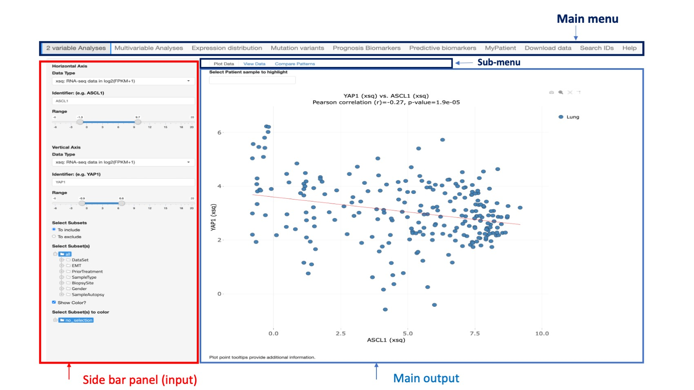

**Figure 1**: Main application interface

<h2 id="univariate">2 variable Analyses</h2>
Molecular and/or drug response patterns can be compared to look for possible association in our patient data.  The 2 variable analysis panel includes 3 options: Plot data, Download Data and Compare Patterns. Almost all options have the same input data in the left side panel.

<h4 id="inputs">Input data</h4>

1.	The horizontal axis data choices includes 4 fields to be filled by the user:
  - **Horizontal Axis Patient Set** selects the data set. For now we have only one patient data set.
  - **Horizontal Axis Data Type** selects the data type to query. The options for this appear in the Horizontal Axis Data Type dropdown. See the Metadata tab for descriptions and abbreviations. 
  - **Identifier** selects the identifier of interest for the above selected data type. For instance, if drug response is selected, the user can enter a drug name. The Search IDs tab explores potential identifiers interactively, or to download datasets of interest. 
  - **Horizontal Axis Range** allows the user to control the horizontal axis range for better visualization.
  
2.	The vertical axis data choices are as explained above for the horizontal axis.
  
3.  Selected tissues: by default, all tissues are selected and included in the scatter plot. To include or exclude patient samples from specific tissues, the user should specify:
  - **Select Tissues** to include or exclude specific tissues
  - **Select Tissues of Origin Subset/s** functionality at the bottom of the left-hand panel. The tissues of Origin are organized as a tree and are all selected by default. In order to select a specific tissue, the user should click on the root of the tree represented by the triangle icon to expand the tree recursively until reaching a specific sub tree or leaf. The selection is finalized by clicking on the leaf label. On Macs, more than one tissue of origin may be selected using the "command" button. On PC's use the "control" key. All patient samples were mapped to the two first of the four-level OncoTree cancer tissue type hierarchy developed at <a href="http://www.cbioportal.org/oncotree/" target="_blank" class="dm">Memorial Sloan-Kettering Cancer Center</a>. 
  - **Tissues to Color** to locate samples related to desired tissues within the scatter plot. By default, the samples are colored by their OncoTree cancer tissue level 1 pre-assigned color. Selecting a tissue makes related samples appear in red while remaining samples are colored in grey. The **Show Color** checkbox should be active.
  

<h3 id="plot">Plot Data</h3>
Any pair of features across patient samples can be plotted (as a scatterplot) including the resultant Pearson correlation and p-value. The p-value estimates assume multivariate normal data, and are less reliable as the data deviate from this. Please use the scatter plot to check the data distribution (e.g., for outlying points outside of a more elliptically concentrated set). The user also has the option to select  a set of samples to highlight using a list box of sample Ids on the top of the scatter plot.
  
Some options are available to play with the plot image using icons on the top from left to right:
 
<table>
<tr> <td></td> <td> Downloads the plot as a png.</td> </tr>
<tr> <td></td> <td> Allows the user to zoom in on an area of interest by clicking and dragging with the pointer.</td> </tr>
<tr> <td></td> <td> Autoscales the image.</td></tr>
<tr> <td></td> <td> Allows the user to create horizontal and vertical line from either a sample dot or the regression line, by hovering over them.</td></tr>
</table>

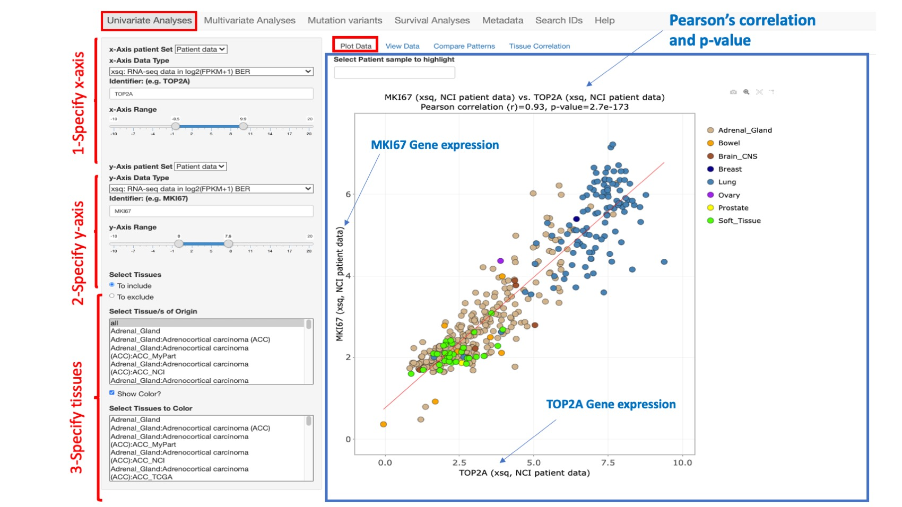

**Figure 2**: An example scatterplot of ASCL1 gene expression (horizontal axis)  versus YAP1 gene expression (verical axis). The Pearson correlation value and p value appear at the top of the plot. A linear fitting curve is included. This is an interactive plot and whenever the user changes any input value, the plot will be updated. Any point in the plot can be hovered over to provide additional information about sample, tissue, Onco tree designation,  and x and y coordinate values.

<h3 id="download">View Data</h3>
This option both displays the data selected from the **Plot Data** tab in tabular form, and provides a **Download selected x and y axis data as Tab-Delimited File** option. The user can change the input data in the left selection panel as described for Plot Data. The displayed table include the sample, the x-axis value, the y-axis value, the tissue of origin, the 4 onco-tree levels and other available sample annotation such as Epithelial Mesenchymal Transition (EMT) status. Within the header the selected features are prefixed by the data type abbreviation and post-fixed by the data source.

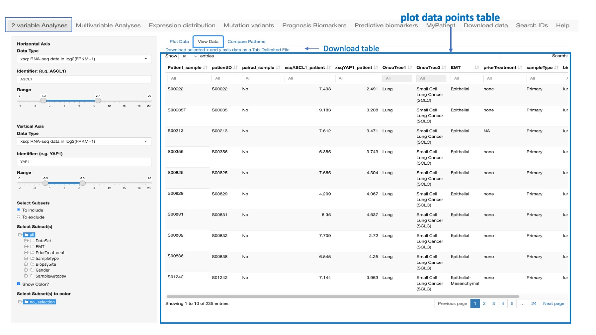

**Figure 3**: Shows the selected values for ASCL1 gene expression (horizontal axis) and YAP1 gene expression (vertical axis) across all samples. The features are coded as xsqASCL1_patient and xsqYAP1_patient where “xsq” represent gene expression based on rnaseq.

<h3 id="compare">Compare Patterns</h3>
This option allows one to compute the correlation between the selected feature as defined from the specified **Horizontal Axis sample Set, Horizontal Axis Data Type**, and **Identifier** and either all drug or all molecular data from the (same) Horizontal Axis or Vertical Axis source. By default all tissues are selected however the user can restrict the analysis to specific tissue of origin.

Pearson’s correlations are provided, with reported p-values (adjusted for multiple comparisons) in tabular form. This displays features are organized by level of correlation, and includes target pathway for genes and mechanism of action (MOA) for drugs (if available). 

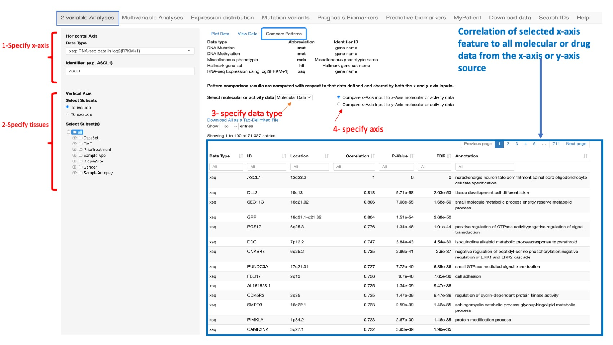

**Figure 4**: Shows correlation results for ASCL1 gene with all other molecular features for all data types (gene expression, mutation and metadata) sorted by correlation value with gene location and target pathways (annotation field).

<h2 id="regression">Multivariable Analysis</h2>
The ‘Multivariable Analysis’ option (or module) has multiple tabs including Heatmap, Data, Plot, Cross-Validation, Technical Details and Partial Correlation (described below), and allows construction and assessment of multivariate linear response prediction models within a patient set. For instance, we can assess prediction of a drug response based on some genes expression. To construct a regression model, you first need to specify the input data in the left side panel.

<h4 id="inputs2">Input data</h4>

1. The response variable is chosen by selecting:
  - **Response patient Set** for now the current patient set
  - **Response Data Type** selects the data type for the response variable (example: drug response or a molecular dataset). The options appear in the Response Data Type dropdown. See the Metadata tab for data types description.
  - **Response Identifier** selects the identifier for the response variable (e.g., a specific drug or gene identifier)
  
2. The predictor variables are chosen by selecting:
  - **Predictor Data Type/s** selects the data type(s) for the predictors variables. Use command button on Macs or control key on PCs to select more than one dataset.
  - **Minimal Predictor Range** provides a required minimum value for the identifier to be included for the first listed data type. The default is 0. One may increase this value to eliminate predictors that are considered to have insufficient range to be biologically meaningful.
  - **Predictor Identifiers** selects the identifiers for the predictors.When using the **Linear Regression** algorithm, predictors are required to be enter. In figure 5, we explore linear model prediction of Durvalumab/Olaparib drug response choosing MAGEH1 and NFKBIA gene expression. Identifiers from different types may be combined using 2 methods. In the first, select multiple Data Types as desired, and enter your identifiers. The model will be built automatically using those Data Types and Identifiers. For example, if expression and mutation are selected as Data Types and MAGEH1 and NFKBIA are entered as identifiers, the model will be built using 4 identifiers: expMAGEH1, expNFKBIA, mutMAGEH1 AND mutNFKBIA. In the second, more specific approach, you enter the identifier with the data type prefix. For example, if your predictor variables are specifically the expression value for MAGEH1 and mutation value for NFKBIA then you can enter as identifiers: expMAGEH1 and mutNFKBIA. When using the **Lasso** algorithm, predictors are optional for the Lasso algorithm (see point 4) since it identifies automatically the ones that best fit the Lasso model.
  
3. **Select Tissue/s of Origin** is used to include or exclude specific tissues, as defined in the next step. By default, all tissue types are included, howver you can select one or any multiple of tissue types (to include or exclude). Use the radio buttons **To include** or **To exclude** to select specific tissues to include or exclude.  To make selections on Macs, use the “command” key. To make selections on PC's use the “control” key
  
4. **Algorithm**: by default, the mode **Display** is selected to review the data however you can select the **Linear Regression** model or the **Lasso** model (penalized linear regression model) machine learning approach. Linear regression is a linear approach to modeling the relationship between a response (or dependent variable) and one or more predictor variables (or independent variables). It is implemented using the R stats package lm() function. 10-fold cross validation is applied to fit model coefficients and predict response, while withholding portions of the data to better estimate robustness. Lasso is Least absolute selection and shrinkage operator, a penalized linear regression model. Lasso is implemented using the cv.glmnet function (R package glmnet). Lasso performs both variable selection and linear model coefficient fitting. The lasso lambda parameter controls the tradeoff between model fit and variable set size. Lambda is set to the value giving the minimum error with 10-fold cross-validation. The lasso lambda parameter controls the tradeoff between model fit and variable set size. The Lambda is set to the value giving the minimum error with 10-fold cross-validation. Set.seed, the initial seed is set to 1. Alpha is set to one. The minimum lambda is used to select the intercept and the coefficient for the variable (there is no range). 10-fold cross validation is applied to fit model coefficients and predict response, while withholding portions of the data to better estimate robustness. For further details on either of these outputs, see the respective R packages. If Lasso algorithm is selected, you have to specify:
  - **Select Gene Sets**: The gene selection is based on curated gene sets such as DNA Damage Repair DDR or Apoptosis. The user can select one or more gene sets.
  - **Maximum Number of Predictors** allows choice of the number of predictors (default 4)

Once all the above information is entered, a regression model is built and the results are shown in different ways such as the technical details of the model, observed vs. predictive responses plots or variables heatmap. Find below an explanation of different output for the regression model module.

<h3 id="heatmap">Heatmap</h3>
This option provides the observed response and predictor variables across all samples as an interactive heatmap. For the heatmap visualization, data are range standardized (subtract the minimum, and divide by the range) to values between 0 and 1, based on the value range within all rows of a given data type (by default) or within each row of data (if ‘Use Row Color Scale’ is selected). For data types other than mutation data, the range is trimmed to the difference between the 95th and 5th percentiles; values below or above the 5th and 95th percentile values are scaled to 0 and 1, respectively. In the case of mutation data, the range used for scaling is the difference between the maximum and minimum values. If the values within a data type (or data row if ‘Use Row Color Scale’ is selected) are constant, the scaled value for heatmap visualization is set to 0.5.

The user can restrict the number of samples to those that have the highest or lowest response values by selecting **Number of High/Low Response Lines to Display**. The user can download the heatmap related data by clicking on **Download Heatmap Data**.

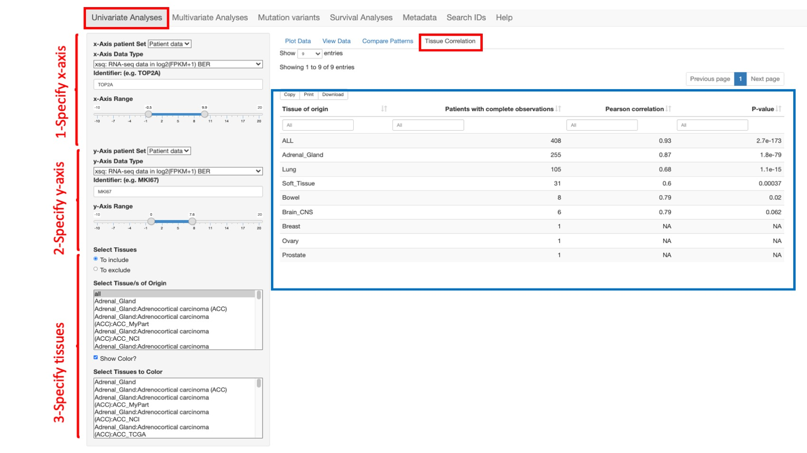

**Figure 5**: An example heatmap where we selected ASCL1 as a response variable and; INSM1, DLL3, CHGA, NEUROD1, POU2F3 and NOTCH1 gene expression as predictor variables. 

If the Lasso algorithm is selected (see below) more predicted variables are added (ABCC10 and POU2F3 are added)

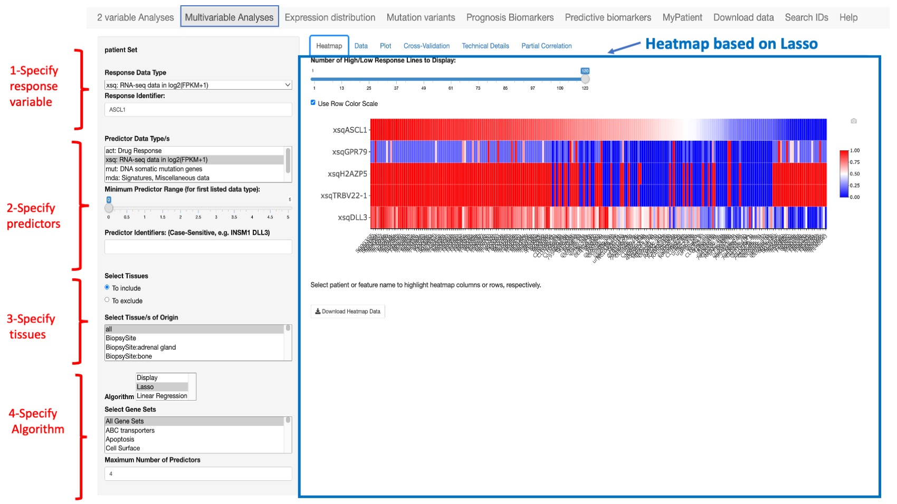

**Figure 6**: Same example as previous figure with the Lasso algorithm using ABC transports gene set.

<h3 id="data">Data</h3>
This option shows the detailed data for the model variables for each sample. Both the 10-fold cross validation (CV) as well as the predicted responses are given. The data is displayed as a table with filtering options for each column. 

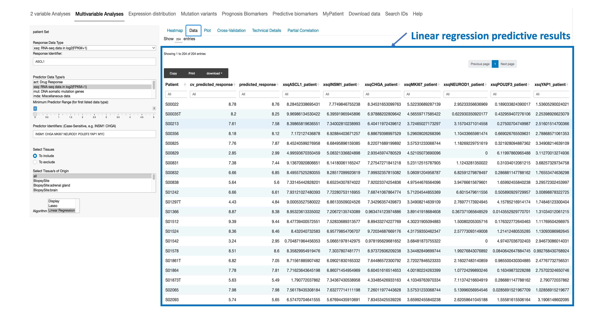

**Figure 7**: Data related to the simple linear regression model presented in the previous section.

<h3 id="plotpred">Plot</h3>
This option enables one to plot and compare the observed response values (y-axis) versus the predicted response values (x-axis). The predicted response values are derived from a linear regression model fit to the full data set.

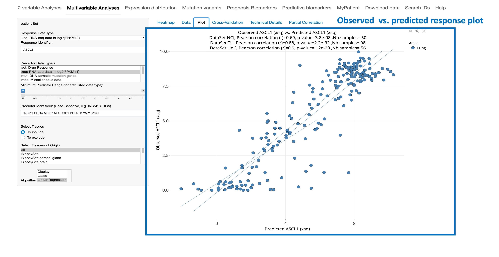

**Figure 8**: Plot comparing ASCL1 observed vs. predicted expression with high correlation value of 0.88

<h3 id="cross">Cross-Validation</h3>
This option enables plotting the observed response values (y-axis) versus the 10-fold cross-validation predicted response values (x-axis). With this approach, the predicted response values are obtained (over 10 iterations) by successively holding out 10% of the samples and predicting their response using a linear regression model fit to the remaining 90% of the data. After all 10 folds have been done, each sample has one cross-validated prediction (since each sample gets in the test set once). We compute the correlation between these cross-validated predictions and the true responses.

Cross-validation is widely used in statistics to assess model generalization to independent data – with the caveat that the independent data must still share the same essential structure (i.e., probability distribution) as the training data. It can also indicate possible overfitting of the training data, such as when the observed versus full data set model-predicted correlation (shown in ‘Plot’) is substantially better than the observed versus cross-validation predicted correlation (shown in ‘Cross-Validation’).

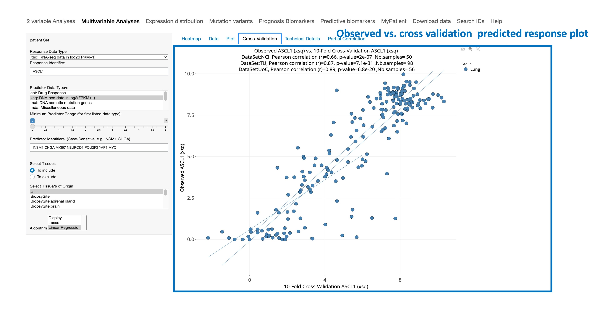

**Figure 9**: Plot comparing ASCL1 observed vs. cross-validation predicted activity with still high correlation value of 0.87

<h3 id="details">Technical Details</h3>
This option enables the user to view the R statistical and other technical details related to the predicted response model. To save, these results may be copied and pasted into the document or spreadsheet of your choice. 

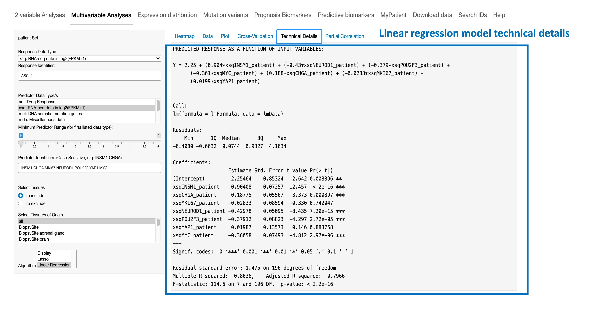

**Figure 10**: Example of regular regression model fitting results

<h3 id="partialcorr">Partial correlations</h3>

This function is used to identify additional predictive variables for a multivariate linear model. Conceptually, the aim is to identify additional predictive variables that are independently correlated with the response variable, after accounting for the influence of the existing predictor set. Computationally, a linear model is fit, with respect to the existing predictor set, for both the response variable and each candidate predictor variable. The partial correlation is then computed as the Pearson’s correlation between the resulting pairs of model residual vectors (which capture the variation not explained by the existing predictor set). The p-values reported for the correlation and linear modeling analyses assume multivariate normal data. The two-variable plot feature of CellMinerCDB allows informal assessment of this assumption, with clear indication of outlying observations. The reported p-values are less reliable as the data deviate from multivariate normality.

In order to run a partial correlation analysis, the user should first construct a linear model (providing response and predictor variables as explained earlier - steps 1 to 4 in figure below-) and then:
  -	**Select Gene Sets**: The gene selection is based on curated gene sets. Here the user can select one or more gene sets and even all genes (step 5 in figure below)
  -	**Select Data types**: the user can select one or more data type such as gene expression, methylation or copy number variation (step 6 in figure below)
  -	optionally, specify the **Minimum Range** for the first listed data type (step 7 in figure below)
  - And finally click on button **run** (step 8 in figure below).
  
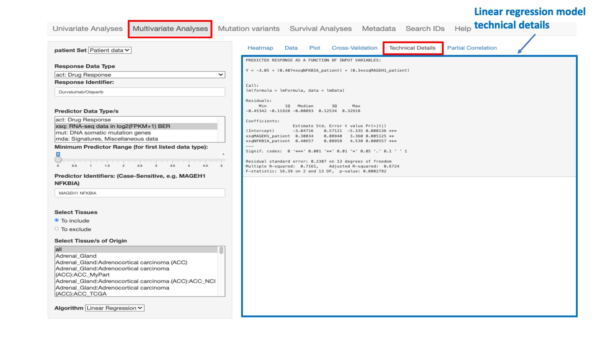

**Figure 11**: An example of  partial correlation results for selected gene expression data using all gene sets.

<h2 id="workflow">Exploratory workflow</h2>
Mutilple data analysis workflows may be used dependent of the question being asked. A typical workflow:

1.  Check the relationship between two variables [2D plot]. 
 
2.  Examine what else might be associated with either the horizontal axis or vertical axis variable [Pattern Comparison]. 
 
3.  Upon finding two or more associations with single 'response' variable through [Pattern Comparison/2D Plot], check if they complement one another in a multivariate model [Regression Models]. 
 
4.  Repeat the above steps as needed.

<h2 id="distribution">Expression distribution</h2>

The expression distribution option enables to display for a selected gene its expression distribution within each dataset using interactive boxplots.

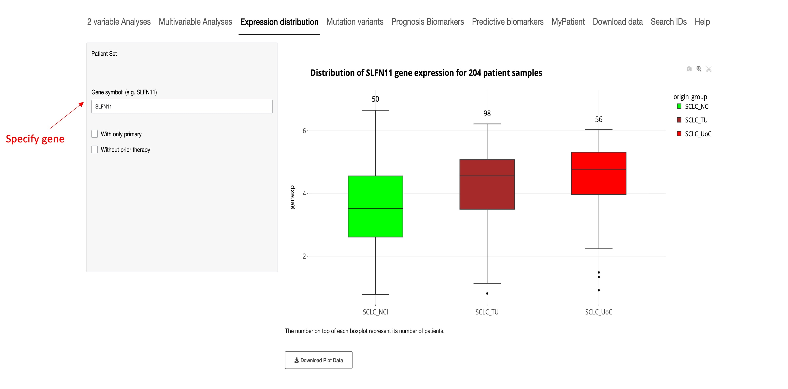

**Figure 12**: An example of  Expression distribution for selected gene SLFN11.

<h2 id="mutation">Mutation Variants</h2>

The Mutation Variants option allow to query all variants for the selected genes across all samples. Each variant is well annotated with details such as such as variant allele frequency (VAF), mutation type (Exonic function) and Amino Acid changes (AAChange). The AAChange specfies the cDNA (c.) and the protein (p.) changes for all gene transcripts. All other details can be found by scrolling to the right of the screen. 

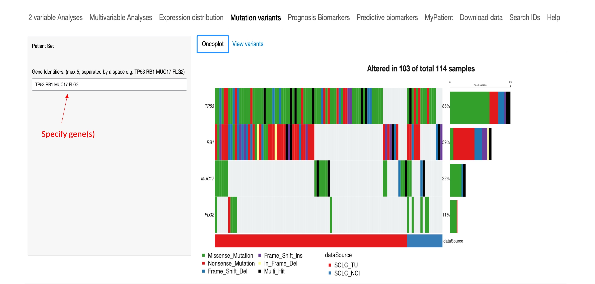

**Figure 13**: An example of mutation variant Oncoplot for selected genes TP53, RB1, MUC17 AND FLG2.

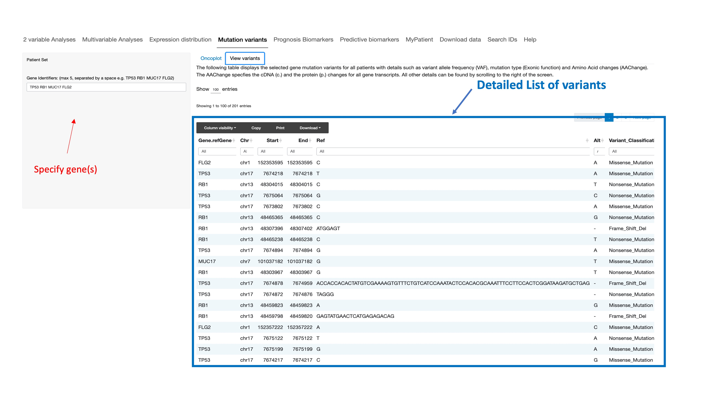

**Figure 14**: An example of  mutation variants details view for selected genes TP53, RB1, MUC17 AND FLG2.

<h2 id="survival">Prognosis Analysis</h2>

The survival analysis is based on Kaplan Meier plot and Cox proportional-hazards model focusing on overall survival information. To proceed, you first need  to specify the input data in the left side panel.

**Input data:**

1. dataset: Since the data is collected from different collaborators, you need to select the appropriate dataset. The user can select multiple datasets.
 
2. data type: You need to select gene expression, mutation or metadata/signatures
 
3. gene(s): You can enter a gene symbol of interest. Multiple genes is only allowed to gene expression.
 
4. Options:
   - samples: You can restrict the number to those which are primary or without prior treatment
   - group selection: You can define 2 groups based on median, quartile or tercile.
   - gender: You can select specific gender.
   - Lasso: You can run Lasso Cox model on gene expression. No input gene list is needed. If Lasso algorithm is selected, you have to specify:
      - **Select Gene Sets**: The gene selection is based on curated gene sets such as DNA Damage Repair DDR or Apoptosis. The user can select one or more gene sets.
      - **Maximum Number of Genes** allows choice of the number of genes (default 4, max 20)

**Output:**

In case of one gene or one variable the user will have:
- Cox univariate model summary results based on the variable as a continuous one
- Cox univariate model summary results based on the variable as a discrete with 2 groups
- Kaplan Meier plot based on 2 groups showing the Cox model Hazard ratios from the 2 previous models
- Heatmap showing the Overall survival with the genes values across all samples

In case of multiple genes (for gene expression) the user will have:
- Cox multivariate model summary results 
- Cox univariate model summary results based on the average of the multi-genes input
- Cox univariate model summary results based on 2 groups from average of multi-genes input
- Kaplan Meier plot based on the average of the multi-genes input showing Hazard ratios from the 2 previous models.
- Heatmap showing the Overall survival with all selected genes values across all samples

In case of Lasso (for gene expression) the user will have:
- Lasso Cox  model summary results 
- Cox univariate model summary results based on the average of Lasso output genes
- Cox univariate model summary results based on 2 groups from average of of Lasso output genes
- Kaplan Meier plot based on 2 groups from average of of Lasso output genes showing Hazard ratios from the 2 previous models.
- Heatmap showing the Overall survival with all Lasso output genes values across all samples

The following figures 15 to 18 show an example of multivariate survival analysis based on user-specified genes where figures 19 and 20 show an example using Lasso approach.

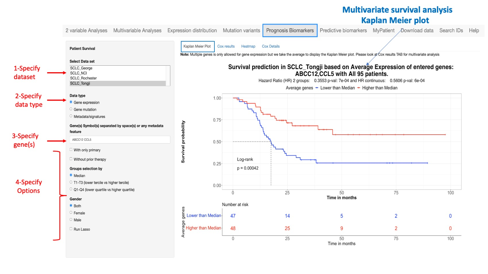

**Figure 15**: An example of Kaplan Meir plot based on average gene expression of CCL5 and ABCC12 in Tongji SCLC patients

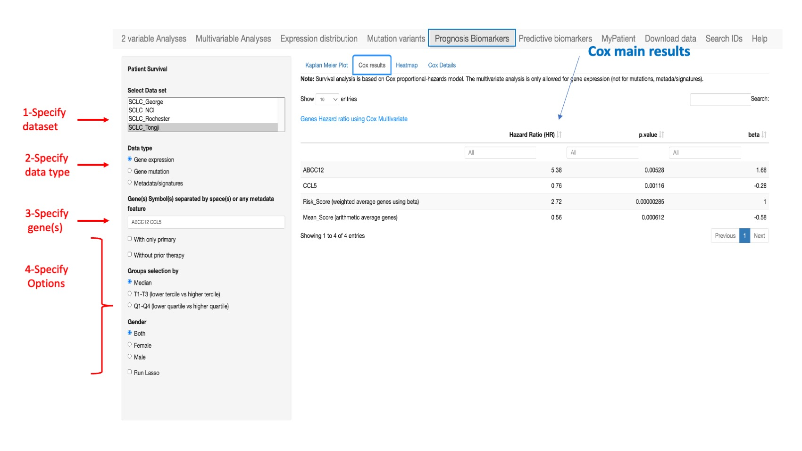

**Figure 16**: Multivariate Cox analysis summary results from the previous example in figure 15

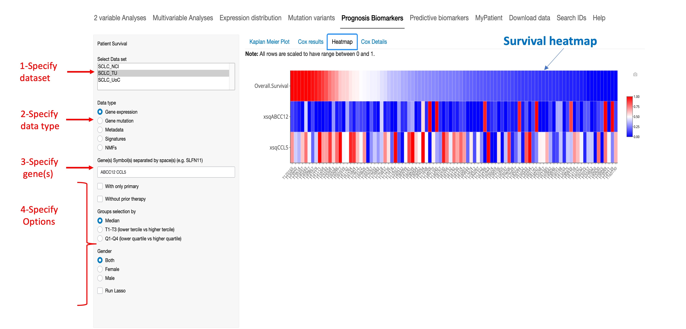

**Figure 17**: Heatmap of overall survival and selected genes from the previous example in figure 15

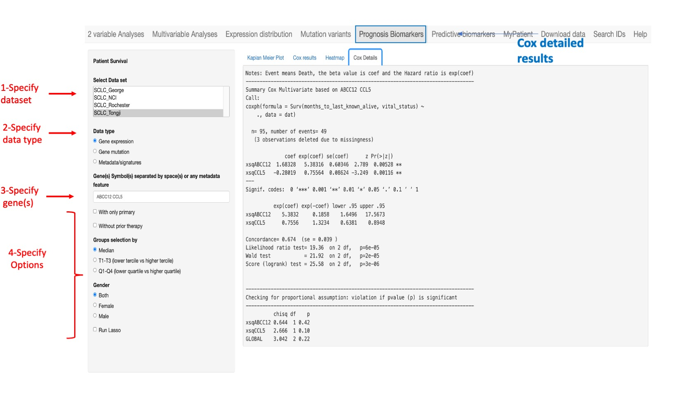

**Figure 18**: Multivariate Cox analysis detailed results from the previous example in figure 15

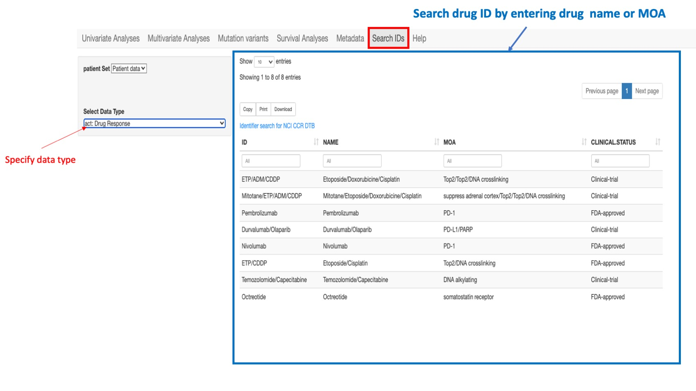

**Figure 19**: An example of Lasso Cox analysis that predicts a set of 4 ABC transporter prognostic genes in Tongji SCLC patients: ABCC12, ABCB1, ABCG4 and ABCA9. Here we show the Kaplan Meier plot based on the average of the 4 genes.

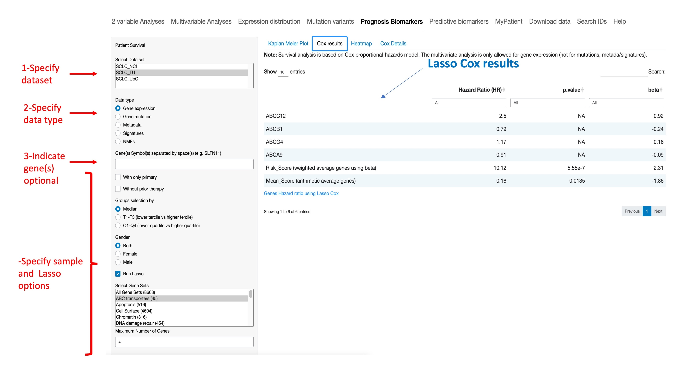

**Figure 20**: Lasso Cox analysis summary results from the previous example in figure 19

<h2 id="predictive">Predictive biomarkers</h2>

This option allows to compare predictive biomarkers expression to other Molecular and/or drug response patterns for possible association in our patient data.  This is similar to the 2 variable analysis option but the horizontal axis is dedication to the gene expression of our curated list of predictive biomarkers. 
Input and output details can be viewed in the **2 variable analyses** section.

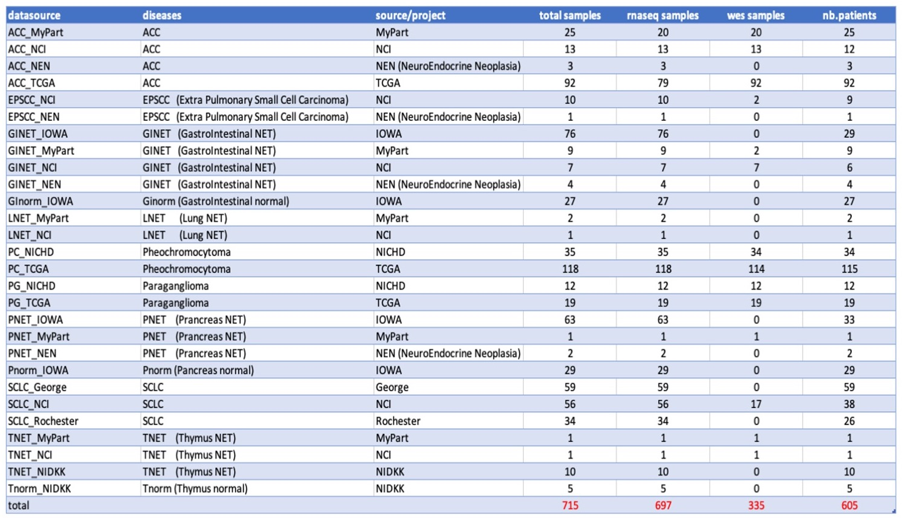

**Figure 21**: Main predictive biomarkers interface

<h2 id="MyPatient">MyPatient</h2>
TumorMiner module permits users to search for specific patients, access their main clinical features, and explore top molecular characteristics, including gene expression and mutation. The patient module offers an in-depth view of a patient's genomic data, accompanied by the ability to filter, and analyze known biomarkers. This module also offers opportunities to identify comparable patient cohorts and relevant cell lines, contributing to finding potential targeted therapeutic solutions.

<h3>Patient Lookup</h3>

Users can search for patients based on various parameters such as patientID, gender, age, race, overall survival in months (osMonths), smokingStatus, packYearsSmoking, disease, dataSet, Number_of_Samples, and Treatment_Available. Multiple filters can be applied simultaneously, and users can additionally sort by any of the parameters. For instance, Figure 22 shows the Patient Look Up table, containing SCLC patients sorted by the number of samples.   Upon selecting on a row in the Patient Look Up table, users are immediately directed the Clinical Data page. 

 

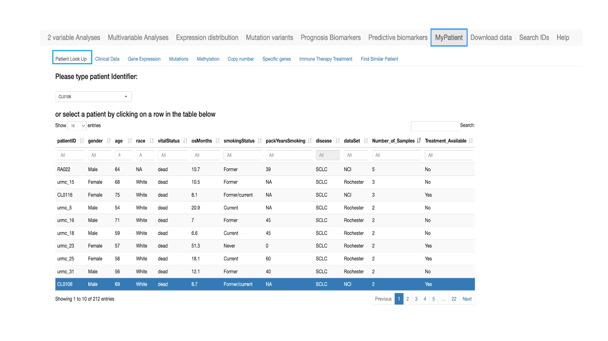

**Figure 22**: Patient Look Up Table of the MyPatient Module where Patient CL0106 is selected

<h3>Clinical Data</h3>

The Clinical Data page displays both the demographic data and sample data of the selected patient. The demographic data displayed contains the same parameters as shown on the Patient Look Up page, and the default sample data contains the following parameters: Sample_Name, OncoTree1, OncoTree2, priorTreatment, sampleType, dataSource, biopsySite, tumorStage, Genomic Information codes (xsq for RNAseq, mut for mutation,met for methylation,cop fpr copy number), Treatment_Name, Response_to_treatment, Tumor mutation burden (TMB) and KI67% (KI67perc). Figure 23 shows that Patient CL0106 has 2 samples from 2 NCI with sample CL0106_T1 having both gene expression and mutation whereas CL0106_T2 having only expression data.   By clicking on the column visibility button, users can display additional columns such as patientID, TissueType, OncoTree3, OncoTree4, EMT, MSI.TSO500, TMB.TSO500, Hormone.prod, CgA.stain, SyP.positive, Insm1. 

 

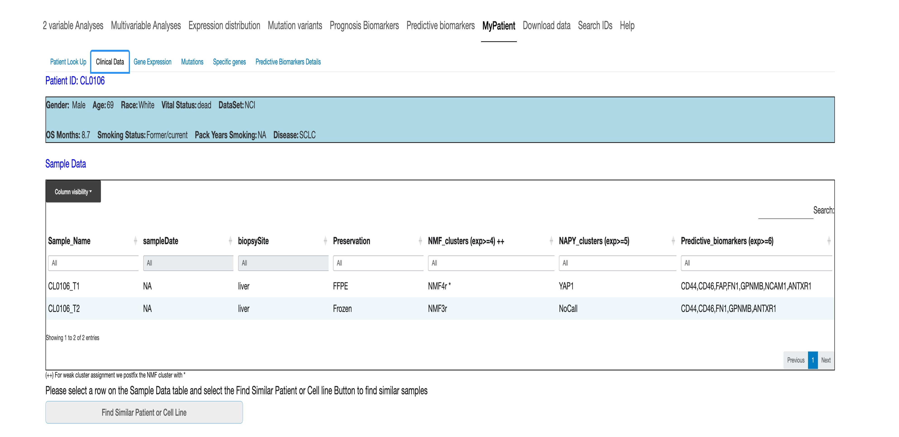

**Figure 23**: Clinical Data Table of the MyPatient Module, Patient ID: CL0106

<h3>Gene Expression, Mutation Pages</h3>
After viewing the Clinical Data table, users can look at the patient Gene Expression and  Mutations tables. Users can select genes from categories like all genes, protein coding (only available for gene expression), and biomarkers on the left panel. Users can also display top genes with the highest and lowest expression, mutation, methylation values or specify a range for filtering, enabling more targeted data exploration. For instance, if a user sets the Top and Bottom filter to 100 on the gene expression page, the table would display the top 50 genes with the highest expression, and the bottom 50 genes with the lowest expression. Additional columns such as the mean, fold change, and standard deviation are displayed, depending on the number of samples belonging to a patient. As shown in Figure 4, columns such as the mean and fold change are displayed since Patient CL0185 has two samples. For samples with 3 or more columns, the mean and standard deviation are displayed. By clicking on the "Column Visibility Button", users can access gene annotation data such as the gene symbol, chr, start, end, strand, EnsID, and biotype on the gene expression page; chromosome, map_location, chr_start, chr_stop, chr_orient on the mutation page; and accession, priority, probe.count on the methylation page. 

 

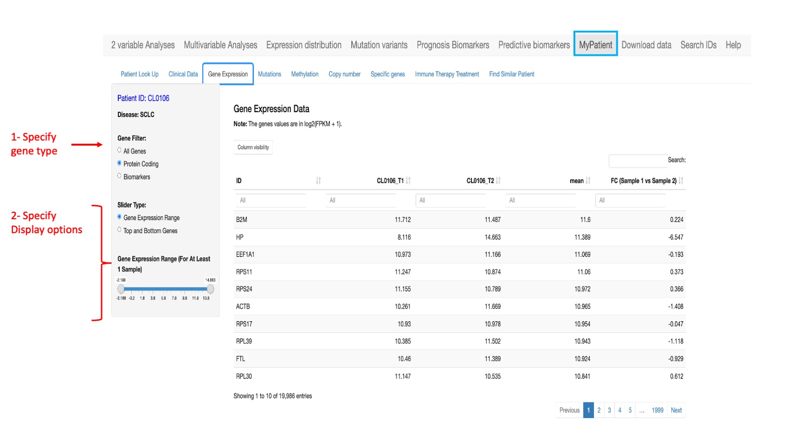

**Figure 24**: Gene Expression table of the MyPatient Module, Patient ID: CL0106

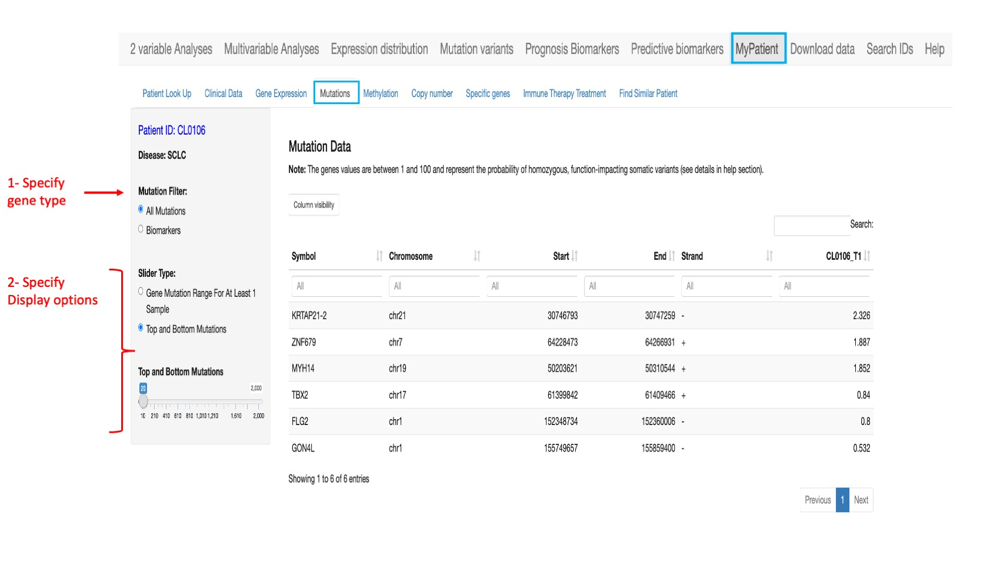

**Figure 25**: Mutation table of the MyPatient Module, Patient ID: CL0106

<h3>Specific genes</h3>
The user can also use the “specific genes” TAB to view specific gene values across all data experiments: gene expression, mutation, methylation and copy  number. In Figure 26, we present the values for patient CL0106 the values of MKI67 and TOP2A genes across all samples and experiments.

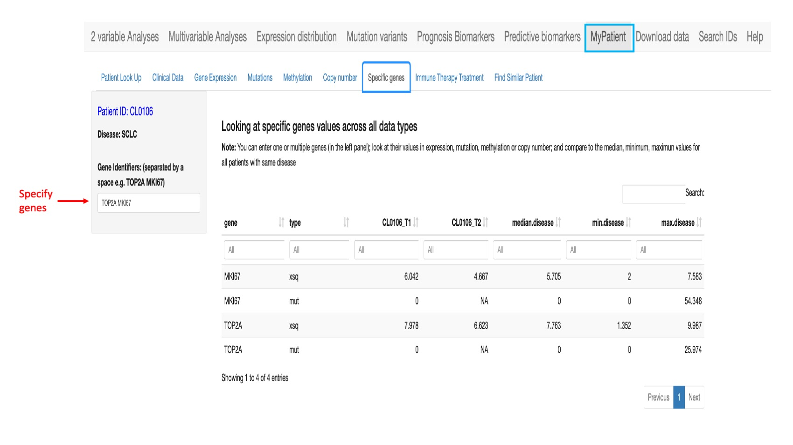

**Figure 26**: Specific genes table of the MyPatient Module, Patient ID: CL0106

<h3>Immune therapy treatment</h3>
We provide for each patient potential Antibody-Drug Conjugate (ADC) treatments. The drugs are selected based on target gene having high expression values (in log2FPKM) greater or equal to 6 in at least one sample. As you can see in figure 27, there are 4 drugs to explore for patient CL0106 care. 

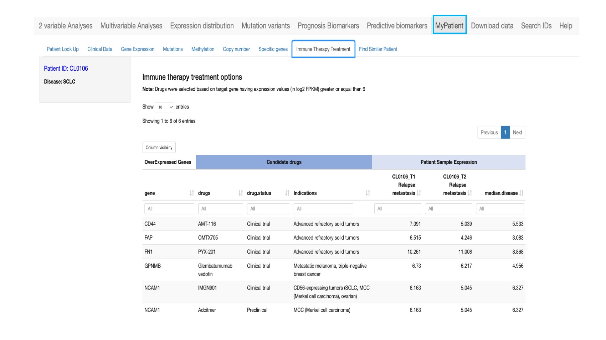

**Figure 27**: Immune therapy treatments for Patient ID: CL0106

<h3>Find Similar Patient or Cell line</h3>
After searching for a specific patient and accessing their clinical and molecular data, users can search for similar patient samples or cell lines relevant to the selected patient sample. By selecting a sample on the Clinical Data page and clicking the "Find Similar Patient or Cell line" button, users are redirected to the Find Similar Patient or Cell line page. Here, similarity scores are based on correlation for gene expression data, as well as based on the number of common mutated genes and clinical features for the selected tumor sample.  

Regarding expression, two options are provided to determine which genes are included when computing Pearson correlation between two samples. 
 
<b>Option I</b> involves utilizing the most variable genes belonging to the selected sample. Here we consider, the top 1000 genes with the highest scores and the bottom 1000 genes with the lowest scores. 
 
<b>Option II </b> involves using biomarkers belonging to the selected sample found in expression.
  

The mutation score between 2 samples is computed based on common mutated genes from selected tumor sample. We do provide an option to select one biomarkers genes for the mutation data.
The sample Profile Score between 2 samples is calculated based on pre-selected features, which include "gender," "age group," "race," "disease," "OncoTree1," "OncoTree2," "tumorStage," "sampleType," and "biopsySite". The similarity score is based on the number of common features divided by the total number of features from the selected sample. 
For each sample we will have similarly scores for expression, mutation and profile and we then compute the mean of genomic scores as well as the sum of all scores

The following figures 28 to 31 shows similarity results of patient sample CL0106_T1 to other patient samples and cell lines.

  
Figure 28 visualizes the results with a balloon plot representing for sample CL0106_T1 the top twenty similar tumor samples based on the sum of all scores

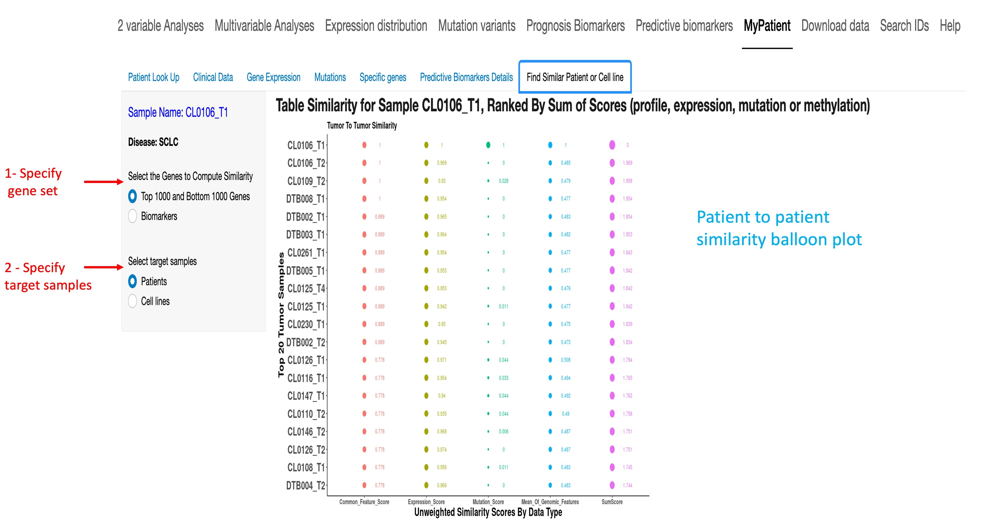
**Figure 28**: Patient to Patient Balloon Plot, Patient Sample ID: CL0106_T1

Figure 29 shows the table of similarity scores between sample CL0106_T1 and all 212 SCLC patient samples, sortable and queryable by any column, facilitating the exploration of genomic correlations and shared characteristics.  

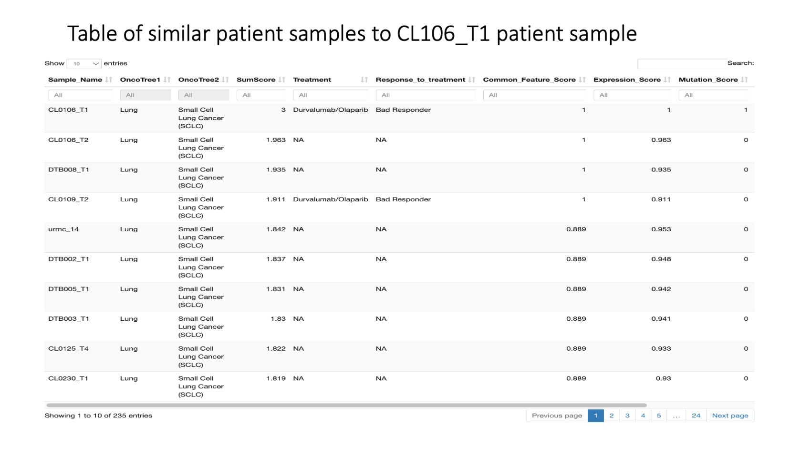
**Figure 29**: Patient to Patient Comparison Table, Patient Sample ID: CL0106_T1

  
Figure 30 visualizes the results with a balloon plot representing for sample CL0106_T1 the top twenty similar CCLE cell lines based on the sum of all scores

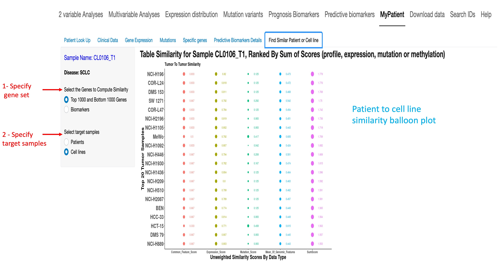
**Figure 30**: Patient to Cell line Balloon Plot, Patient Sample ID: CL0106_T1

Figure 31 shows the table of similarity scores between sample CL0106_T1 and all 1089 CCLE cell lines, sortable and queryable by any column, facilitating the exploration of genomic correlations and shared characteristics.  

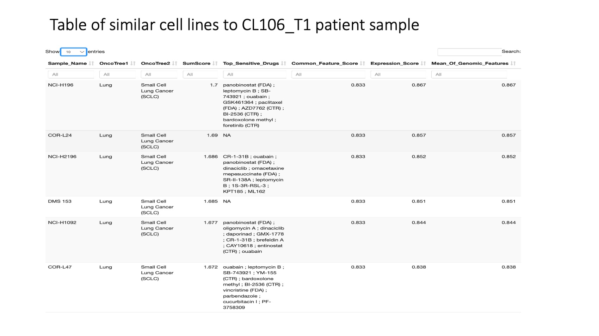
**Figure 31**: Patient to Cell Line Comparison Table, Patient Sample ID: CL0106_T1

<h2 id="metadata">Download data</h2>
The user can download data via: **Select Data Type to Download** and then click on **Download Data type** and/or **Download Data Footnotes** to download any data or footnotes for the selected sample set. Finally the user has the option to **Download current patient set information** by clicking on **Download patients annotation**.

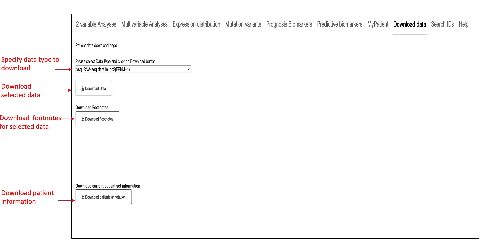

**Figure 32**: Download patient data

<h2 id="search">Search IDs</h2>
This page lists the identifiers (ID) available for use in the univariate analysis, Multivariate Analysis or Survival analysis. The user chooses:
  - **Select Data Type** selects the data type to query. The options for this appear in the x-Axis Data Type dropdown. See the Metadata tab for descriptions and abbreviations.

This enables to search all related ID for each combination. For the molecular data, the **gene names (ID) and specific data type information** are provided. For the drugs and compounds, **the identifiers (ID),  Drug name (when available), and Drug MOA (when available)** are displayed. The user can scroll down the whole  list of IDs, or search specific ID(s) by entering a value in the header of any column.

<h3 id="drugid">Drug IDs</h3>
The drug identifiers (ID) are the Drug names. It could be a single or a combination of drugs.

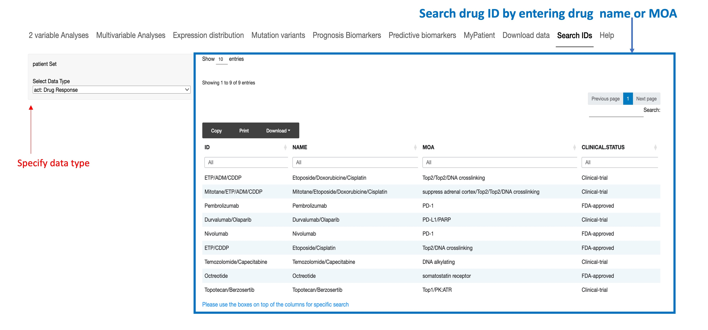

**Figure 33**: Example of a search: if looking for a drug ID select "Drug response" as the data type. You can type in search box of column "Drug name" or "MOA".
 
<h3 id="geneid">Gene IDs</h3>
For all data types, the gene ID is the Hugo gene symbol however the application also recognizes any synonym or previous symbol (alias) that is included in the Hugo database.

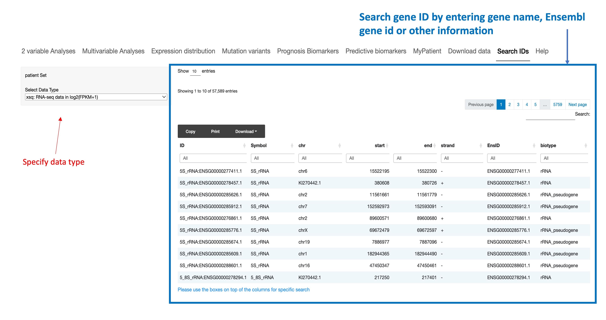

**Figure 34**: Example of a search: if looking for a gene ID, select "gene expression" as the data type. You can type in search box of column "gene name" or "entrez gene id" or "Chromosome"...

<h2 id="navigation">Navigation guide</h2>
<h3 id="multiple">Multiple selection</h3>
In order to select multiple choice from a list, use “command” button for Mac or “alt” button for PC and then click

<h3 id="range">X-axis or Y-axis range</h3>
You can change the x-axis or y-axis lower or higher value to have different views of the displayed plot.

<h3 id="color">Show color</h3>
It is a checkbox that enable and disable colors in the scatter plots

<h2 id="about-the-data">About the Data</h2>

Our genomics patient data currently includes RNA-seq and whole exome seq samples from the National Cancer Institute (NCI) and external collaborators focusing on small cell lung cancer (SCLC). Please see figure 35 for details. Clinical data, survival information and patient drug response data were curated by NCI clinicians.

To reduce the batch effect, all RNASeq and ExomeSeq samples are processed the same way using the NCI Center for cancer research Collaborative Bioinformatics Resource (CCBR) [3,4] pipelines on hg38 human reference. A batch effect removal approach was applied on RNAseq samples to remove the effect of the library preparation (Access, PolyA or TotalRNA). Gene level mutation were computed using specific scripts described in cellminercdb paper [1].

Genomics signatures scores such as Antigen Presentation Machinery (APM), Neuro-Endocrine (NE), Replication Stress or Tumor Mutation Burden (TMB) were computed and can be query with molecular features. Please see the list of these signatures and other miscellaneous features on the Search TAB.

The current drug data is limited to few samples mainly from NCI. We selected for each patient the first drug or drug combination post sampling.  For each pair drug/patient the value is 1 (good responder for partial or complete response) or 0 (bad responder for stable or progessive disease).  

Gene sets used for annotation of analysis results or algorithm input filtering were curated by the
NCI/DTB CellMiner team, based on surveys of the applicable research literature.

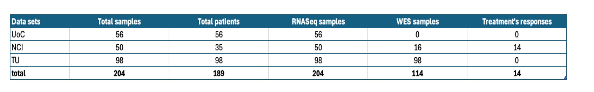
**Figure 35**: Summary of current genomic patient samples.   

The following table  enumerates the available data types that could be queried within the app providing the data type abbreviation or prefix, description, feature value unit (z-score, intensity, probability …), platform or experiment. 

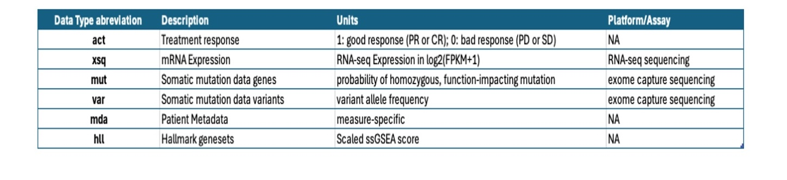
**Figure 36**: Data type metadata.   

<h3 id="gene-summary">Gene Level summary computation</h3>

**RNASEQ (gene expression)**
Gene values were generated based on RSEM log2(FPKM+1).

**WES (Mutation)**
Using paired tumor and normal samples, we generate somatic variants based on our pipeline. We treat the fraction of alternate alleles (the mutation ratio) as a probability that any particular cell has that mutation. Furthermore we assume that the probability that any particular mutation is present in a gene is independent of the probability of any other mutation on that gene. Given those assumptions, we can calculate the overall mutation probability for that gene in any particular cell as 1-(1-p1)*(1-p2)*...*(1-pn), where p1, p2, ..., pn are the mutation ratios for each individual mutation on that gene, 1-pj is the probability that jth mutation is not present for a particular cell. Thus the product is the probability that none of the mutations are present and 1 minus the product is the probability that at least one mutation is present. The expression gives a number that is between 0 and 1, which we multiply by 100 to get the mutation score for that gene.

**Methylation**
Each probe on the array measures the methylation status of one CpG site, i.e. it computes the ratio of the intensity of the methylated probe to the methylated plus unmethylated probe intensities (a value between 0-unmethylated to 1-methylated). For each gene we select a set of probes that are close to the translational start site (TSS) of the gene as well as preferentially on a CpG Island. Please see (5) for details on the probe selection. We compute the average methylation value for all the selected probes which is presented as the methylation value for that gene.

**Copy number**
The copy number are derived from the methylation data. We use the Bioconductor ChAMP package (6) to compute the log copy number at each CpG site. The average for all the CpG sites mapped to a gene is used as the average log copy number of that gene. A value of 0 implies 2N, while -1 implies 1N and 1 implies 4N. Specifically note that we do not do any kind of segmentation since the probe density is not high enough outside of the gene regions.

<h2 id="release">Release history</h2>

February 2025: release v1.0
- Official lunch of website
- Integrated RNASeq and WES for internal and external patient data 
- Enabled survival analysis
- Integrated drug response patient data

<h2 id="about-tumorminer">About TumorMiner</h2>

TumorMiner application has similar design to CellMinerCDB [1] a tool dedicated to mining cell line pharmaco-genomics data across databases. It is developed and maintained using R and Shiny by:
* Fathi Elloumi; Bioinformatics Software Engineer, Developmental Therapeutics Branch, National Cancer Institute

<h3 id="nci-dtb-genomics-and-bioinformatics-group">NCI-DTB Genomics and Bioinformatics Group</h3>

* William C. Reinhold
* Sudhir Varma
* Fathi Elloumi
* Yves Pommier

<h2 id="references">References</h2>

1 Luna A, Elloumi F, Varma S, et al. <a href="https://pubmed.ncbi.nlm.nih.gov/33196823/" target="_blank">CellMiner Cross-Database (CellMinerCDB) version 1.2: Exploration of patient-derived cancer cell line pharmacogenomics.</a>  Nucleic Acids Res. 2021;49(D1):D1083-D1093. doi:10.1093/nar/gkaa968

2 TCGA portal: https://portal.gdc.cancer.gov 

3 CCBR RNAseq pipeline: https://ccbr.github.io/RNA-seek/

4 CCBR WES pipeline: https://github.com/mtandon09/CCBR_GATK4_Exome_Seq_Pipeline#define-inputs-and-outputs

5 Reinhold WC, Varma S, Sunshine M, Rajapakse V, Luna A, Kohn KW, Stevenson H, Wang Y, Heyn H, Nogales V, Moran S, Goldstein DJ, Doroshow JH, Meltzer PS, Esteller M, Pommier Y. The NCI-60 Methylome and Its Integration into CellMiner. Cancer Res. 2017 Feb 1;77(3):601-612. doi: 10.1158/0008-5472.CAN-16-0655. Epub 2016 Dec 6. PMID: 27923837; PMCID: PMC5290136.

6 Yuan Tian, Tiffany J Morris, Amy P Webster, Zhen Yang, Stephan Beck, Andrew Feber, Andrew E Teschendorff, ChAMP: updated methylation analysis pipeline for Illumina BeadChips, Bioinformatics, Volume 33, Issue 24, December 2017, Pages 3982–3984

<h2 id="contactfeedback">Contact/Feedback</h2>
Please send comments and feedback to 
* fathi.elloumi AT nih.gov 
* sudhir.varma AT nih.gov 
